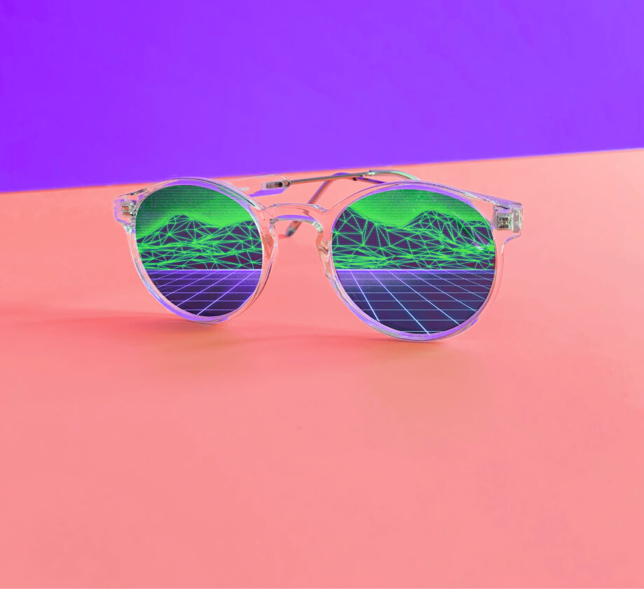

	

		

			

				

					

						
					

					<h1 class="page-title">public servant.</h1>
                            

                            

								

									Over the last 10+ years, I've been help run and manage various transformational organizations, non-profits, governments, and startups, with an eye towards technology that helps people. I have written, spoken, and taught about my learnings in this emerging, exciting, and fun field of public innovation widely, and try my best here to share what I am seeing.
								

                            

                            

                                <a class="soc-link">
                                    
                                </a>
                                <a class="soc-link" href="https://twitter.com/@abhinemani">
                                    
                                </a>
                            

                        

                    

                

                

                    

                        

                            

                                

                                    <h2>Public Innovation Resources</h2>
                                    

                                        

                                            <figure class="block-caption img-caption">
                                                <button class="zoom-btn"></button>
                                                

                                                    
                                                

                                                <figcaption class="caption-text">Lorem ipsum dolor sit amet, consectetur.</figcaption>
                                            </figure>
                                        

                                        

                                            <figure class="block-caption img-caption">
                                                <button class="zoom-btn"></button>
                                                

                                                    
                                                

                                                <figcaption class="caption-text">Lorem ipsum dolor sit amet.</figcaption>
                                            </figure>
                                        

                                        

                                            <figure class="block-caption img-caption">
                                                <button class="zoom-btn"></button>
                                                

                                                    
                                                

                                                <figcaption class="caption-text">Lorem ipsum dolor sit.</figcaption>
                                            </figure>
                                        

                                        

                                            <figure class="block-caption img-caption">
                                                <button class="zoom-btn"></button>
                                                

                                                    
                                                

                                                <figcaption class="caption-text">Lorem ipsum dolor sit amet, consectetur.</figcaption>
                                            </figure>
                                        

                                    

                                

                            

			                

			                    

			                        

			                            

			                                

			                                    <h2>Featured Essays</h2>
											

										

									

								

							

                            

                                <a href="single.html" class="post-item">
                                    
                                    

                                        
Mobile

                                        
APP

                                    

                                    <h3 class="post-title">
                                        Lorem ipsum dolor sit amet, consectetur adipisicing elit. Reprehenderit, modi.
                                    </h3>
                                    

                                        

                                            

                                                
                                            

                                            Maya Delia
                                        

                                        

                                            18 May 2021
                                        

                                        

                                            3457
                                        

                                    

                                </a>
                                <a href="single.html" class="post-item">
                                    
                                    

                                        
Mobile

                                        
APP

                                    

                                    <h3 class="post-title">
                                        Lorem ipsum dolor sit amet, consectetur adipisicing elit. Praesentium tempore fugit asperiores, voluptates expedita. Officia, libero!
                                    </h3>
                                    

                                        

                                            

                                                
                                            

                                            Maya Delia
                                        

                                        

                                            18 May 2021
                                        

                                        

                                            3457
                                        

                                    

                                </a>
                            

                            

                                

                                    <a href="/blog">Show more</a>
                                

                                

                                    <svg class="circular" viewBox="25 25 50 50">
                                        <circle class="path" cx="50" cy="50" r="20" fill="none" stroke-width="2" stroke-miterlimit="10" />
                                    </svg>
                                

                            

                        

                    

                

            
